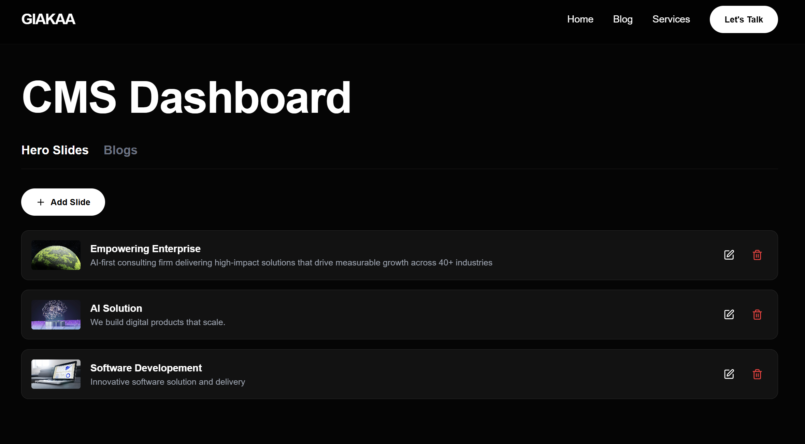
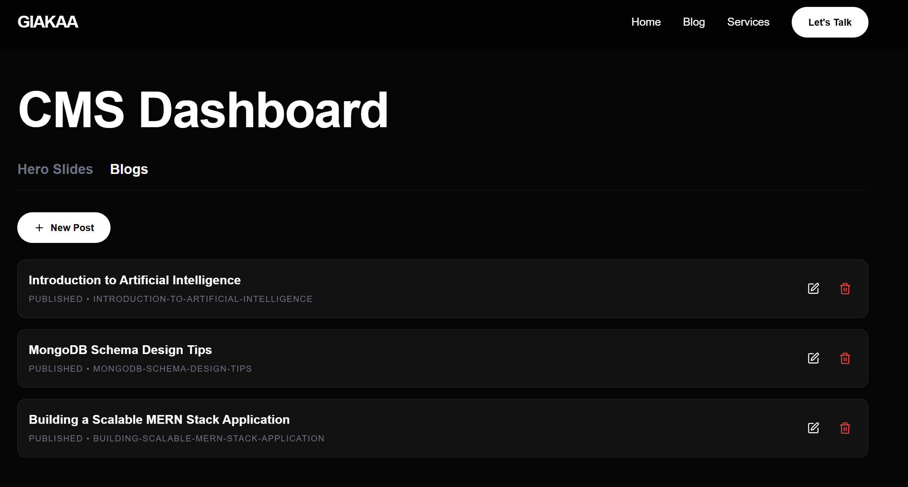

# Giakaa CMS Clone

A full-stack Content Management System (CMS) built to manage the content of a landing page and blog, cloning the layout and structure of Giakaa.com. This project demonstrates backend architecture, frontend implementation, SEO optimization, and secure development practices.

## Project Preview


*Home Page*


*Blog Page*


*Admin Dashboard*


*Blog Management*

## Features

-   **Public Landing Page**: A responsive clone of the Giakaa.com homepage (Hero Slider, Services, Blog Preview).
-   **Blog Platform**: SEO-optimized blog listing and detail pages with server-side rendering.
-   **CMS Admin Panel**: A dashboard to manage content without code changes.
    -   **Hero Slides**: Create, Edit, Delete, and Reorder slides. Toggle active status.
    -   **Blog Posts**: Create, Edit, Delete posts. Manage Draft vs Published status.
-   **SEO**: Dynamic metadata, sitemaps, robots.txt, and canonical URLs.
-   **Security**: Server-side XSS sanitization for user-generated content.

## Architecture Overview

This project uses a decoupled architecture to ensure scalability and separation of concerns:

-   **Frontend**: **Next.js 14 (App Router)**. Chosen for its superior SEO capabilities (Server-Side Rendering), performance (Image optimization), and modern React features.
-   **Backend**: **Node.js + Express**. Chosen for its robustness, scalability, and ease of creating RESTful APIs.
-   **Database**: **MongoDB (via Mongoose)**. Chosen for its flexible schema-less nature, perfect for content-heavy applications where content structures might evolve.

### Folder Structure
-   `client/`: Next.js frontend application.
    -   `app/`: App Router architecture. `page.js` define routes, `layout.js` defines common wrappers.
    -   `components/`: Reusable, modular UI components (Hero, Navbar, etc.).
    -   `public/`: Static assets.
-   `server/`: Express backend application.
    -   `src/models/`: Mongoose schemas defining data structure.
    -   `src/controllers/`: Business logic separated from routes.
    -   `src/routes/`: API endpoint definitions.
    -   `src/config/`: Database configuration.

## SEO Strategy

The application is built with SEO as a primary priority:

1.  **Server-Side Rendering (SSR)**: All critical pages (Home, Blog Listing, Blog Detail) use Next.js SSR. This ensures search engine bots receive fully rendered HTML content immediately.
2.  **Dynamic Metadata**: The `generateMetadata` function in Next.js dynamically fetches blog details to populate `<title>`, `<meta name="description">`, and OpenGraph tags for social sharing.
3.  **Canonical URLs**: Every blog post includes a canonical URL tag `(e.g., /blog/my-slug)` to prevent duplicate content issues.
4.  **Sitemap & Robots**:
    -   `sitemap.xml`: Dynamically lists all published blog posts, updated automatically.
    -   `robots.txt`: Configured to allow indexing of public pages while blocking the `/admin` area.
5.  **Semantic HTML**: Proper use of `<header>`, `<main>`, `<article>`, `<h1>`, `<h2>` tags to guide crawlers through the content hierarchy.
6.  **Performance**: Images are optimized using `next/image` with lazy loading and automatic resizing to improve Core Web Vitals (LCP).

## Database Schema & Indexing Decision

### HeroSlide Schema
-   **Fields**: `title`, `description`, `imageUrl`, `ctaText`, `ctaLink`, `order`, `active`.
-   **Decision**: `order` field allows manual sorting of slides. `active` boolean allows hiding slides (e.g., seasonal promotions) without deleting them.

### BlogPost Schema
-   **Fields**: `title`, `slug`, `content`, `metaTitle`, `metaDescription`, `featuredImage`, `status`, `timestamps`.
-   **Indexing**: 
    -   `slug`: Indexed and Unique. Essential for fast lookups by URL (`/blog/:slug`).
    -   `status`: Indexed. Allows efficient filtering of only `published` posts for the public API.

## CMS Functionality & Verification

### Admin Dashboard (`/admin`)
**URL: [http://localhost:3000/admin](http://localhost:3000/admin)**

The admin panel provides a simple interface for content management:
-   **Hero Management**: Add new marketing slides, update text/links, or remove old campaigns.
-   **Blog Management**: Write and edit articles. Set status to 'Draft' to hide from public view while working, then switch to 'Published'.

### CRUD Verification
The application includes a verification script (`test-crud.js`) that programmatically tests the full content lifecycle:
1.  **Create**: POST a new blog entry -> Returns `201 Created`.
2.  **Read**: GET the entry by slug -> Returns `200 OK`.
3.  **Update**: PUT changes to the title -> Returns `200 OK` (with updated data).
4.  **Delete**: DELETE the entry -> Returns `200 OK`.
5.  **Confirm**: GET the entry again -> Returns `404 Not Found`.

## Trade-offs & Future Improvements

-   **CMS Authentication**: For the scope of this assignment, the `/admin` route is unprotected. In a production environment, I would implement **NextAuth.js** or JWT-based authentication to secure this route.
-   **Image Hosting**: Images are currently stored as URLs. A production app would use **AWS S3** or **Cloudinary** for image uploads and serving.
-   **Rich Text Editor**: The admin panel uses a raw HTML/text area. A production version would integrate a WYSIWYG editor like **Tiptap** or **Quill**.
-   **Testing**: Basic API verification is included. A full suite would involve **Jest** (Unit Tests) and **Playwright** (E2E Tests).

## Setup Instructions

### Prerequisites
-   Node.js installed
-   MongoDB installed and running locally

### 1. Backend Setup
```bash
cd server
npm install
# Create .env file with:
# PORT=5000
# MONGODB_URI=mongodb://127.0.0.1:27017/giakaa_cms
npm run seed  # Seeds initial data
npm run dev   # Starts server on port 5000
```

### 2. Frontend Setup
```bash
cd client
npm install
# Create .env.local file with:
# NEXT_PUBLIC_API_URL=http://localhost:5000/api
npm run dev   # Starts client on port 3000 (or 3001/3005)
```

## Security
-   **XSS Protection**: `sanitize-html` is used on the server-side rendering of blog posts to strip malicious scripts from the content before sending it to the client.

## Deployed Link

🌐 Frontend (Vercel)

https://next-js-blog-website-buxb.vercel.app

🔐 Admin Panel

https://next-js-blog-website-buxb.vercel.app/admin

🖥 Backend API (Render)

https://next-js-blog-website.onrender.com
